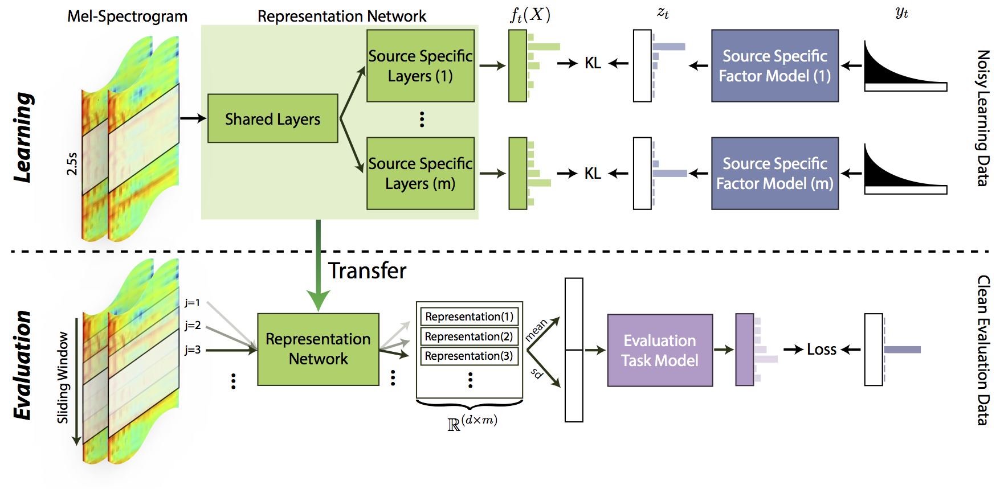

# One Deep Music Representation to Rule Them All?
## A Comparative Analysis of Different Representation Learning Strategies



This repository provides the codebase used in the [work](https://link.springer.com/article/10.1007/s00521-019-04076-1). This codebase includes all the relavant codes that are used for the experiments: 1) data preprocessing, 2) training, 3) feature extraction, 4) evaluation. The core functionalities are implemented and located under main source directory `musmtl` and scripts for each step of the experimental pipeline is located in `scripts` directory. The evaluation setups (the tracks and splits that are used in the evaluation setup) are stored in `eval/data/` directory. The recommender system models used in the experiments are implemented in [separated repository](https://github.com/eldrin/mf-numba/tree/7f2e5eef3e1a401117c70674cec066b37af8be59), for further maintenance and development. (we're planning keep developing this!)


## Dependencies

The dependencies of this repository can be found in `Pipfile`, where all the relavant information is described. The most recommended way to setup the environment is to use [`pipenv`](https://github.com/pypa/pipenv). Assuming `pip` is already installed on the environment, (if it's not, please install the [`pip`](https://pip.pypa.io/en/stable/installing/) first)

```
$pip install pipenv
```

Afterwards, one can easily build a python virtual environment by calling

```
$pipenv install
```

at the root of this git repository. Once the virtual environment is installed, you can activate it by:

```
$pipenv shell
```

Inside the virtual environment, you can proceed further actions. Alternatively, you can also build your own virtual environment or just using your python environment once the minimal requirements are met. (i.e. Python3, [`PyTorch`](https://pytorch.org/) (>=0.4.0), Numpy, etc.)


## Feature Extraction

To extract CNN features from provided model, one should first download the model files from the [dataset page](https://data.4tu.nl/articles/dataset/MTL_Music_Representation_data_underlying_the_publication_One_deep_music_representation_to_rule_them_all_A_comparative_analysis_of_different_representation_learning_strategies/12692300/1). Once the model is stored locally, one then can extract features by calling following command.

```
$python scripts/ext_feat.py model_checkpoints.txt target_audios.txt /path/to/save/outputs/ --no-gpu
```

The `model_checkpoints.txt` should contain the paths for the models you want to deploy for the extraction (one model per line). The `target_audios.txt` file is another text file that lists the audio files to be processed. The third argument is the path where the output files going to be saved. Final argument, either `--no-gpu` or `--gpu`, is the flag for indicating the computation is executed on GPU or CPU. (If your computing environment is not equiped with any GPU, the process will be forced to be done in CPU)

## Reproduction of the Experiment

`TDB`


## Referencing the Work

To use this work for other research projects or paper, please consider citing:

```
@Article{Kim2019,
author="Kim, Jaehun
and Urbano, Juli{\'a}n
and Liem, Cynthia C. S.
and Hanjalic, Alan",
title="One deep music representation to rule them all? A comparative analysis of different representation learning strategies",
journal="Neural Computing and Applications",
year="2019",
month="Mar",
day="04",
issn="1433-3058",
doi="10.1007/s00521-019-04076-1",
url="https://doi.org/10.1007/s00521-019-04076-1"
}
```
